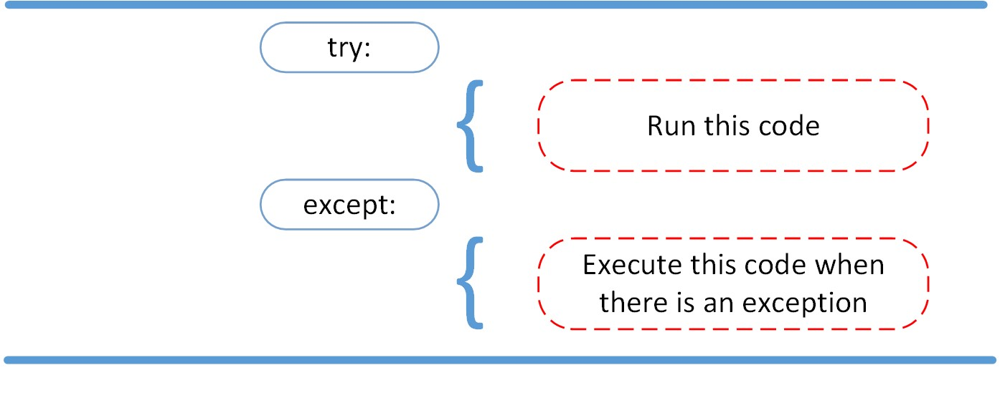

## FileIO & Exceptions

### Reading and Writing Files in Python

#### What Is a File?

"a file is a contiguous set of bytes used to store data."

### what about the data ?

"This data is organized in a specific format and can be anything as simple as a text file or as complicated as a program executable."

### File systems:

systems are composed of three main parts:

- Header: metadata about the contents of the file (file name, size, type, and so on)

- Data: contents of the file as written by the creator or editor

- End of file (EOF): special character that indicates the end of the file

### Opening and Closing a File in Python

`file = open('dog_breeds.txt')`

`reader = open('dog_breeds.txt')`
`try:
    # Further file processing goes here
finally:
    reader.close()`

*always make sure that an open file is properly closed.*

## Python Exceptions

### Exceptions versus Syntax Errors:

- Syntax errors occur when the parser detects an incorrect statement.

- exception error:  This type of error occurs whenever syntactically correct Python code results in an error. 

### The AssertionError Exception

*We assert that a certain condition is met. If this condition turns out to be True, then that is excellent! The program can continue. If the condition turns out to be False, you can have the program throw an AssertionError exception.*

### The try and except Block: Handling Exceptions

`try:
    with open('file.log') as file:
        read_data = file.read()
except:
    print('Could not open file.log')`

`try:
    linux_interaction()
except AssertionError as error:
    print(error)
else:
    try:
        with open('file.log') as file:
            read_data = file.read()
    except FileNotFoundError as fnf_error:
        print(fnf_error)`

