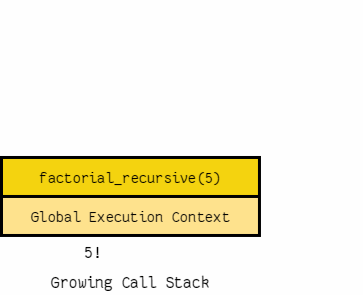

## Classes and Objects:

*Classes are  templates to create your objects*

### Basic Class:

```
class MyClass:
    variable = "blah"

    def function(self):
        print("This is a message inside the class.")
```


- *to assign the above class(template) to an object:*

```
class MyClass:
    variable = "blah"

    def function(self):
        print("This is a message inside the class.")

myobjectx = MyClass()
```

- now the variable (myobjectx) holds an object from the class contains the variable and the function 

### Accessing Object Variables

to access variables inside the object:

- myobjectx.(name of the variable you want to access)  `myobjectx.variable`

- same for accessing functions 

### init():

"The `__init__()` function, is a special function that is called when the class is being initiated. It's used for asigning values in a class."

```
class NumberHolder:

   def __init__(self, number):
       self.number = number
```

## Dictionaries

*"is a data type similar to arrays, but works with keys and values instead of indexes."*

ex:
```
phonebook = {
    "John" : 938477566,
    "Jack" : 938377264,
    "Jill" : 947662781
}
```

### Iterating over dictionaries:

```
phonebook = {"John" : 938477566,"Jack" : 938377264,"Jill" : 947662781}
for name, number in phonebook.items():
    print("Phone number of %s is %d" % (name, number))
```
#### the output will be :
```
Phone number of Jill is 947662781
Phone number of John is 938477566
Phone number of Jack is 9383772
```

## Modules and Packages:

Modules in Python are simply Python files with  (.py) extension. 

- Importing module objects to the current namespace

`from "folder name" import "import from the folder"`

- Importing all objects from a module :

`from "folder name" import *`


# Thinking Recursively in Python

### Recursive Functions in Python:

its a function will continue to call itself and repeat its behavior until some condition is met to return a result.

*"Behind the scenes, each recursive call adds a stack frame (containing its execution context) to the call stack until we reach the base case. Then, the stack begins to unwind as each call returns its results:"*




### Python Testing with pytest: Fixtures and Coverage:

### Fixtures:

*if you  want to have some objects available to all of your tests. Those objects might contain data you want to share across tests, or they might involve the network or filesystem. These are often known as "fixtures" in the testing world, and they take a variety of different forms.*


