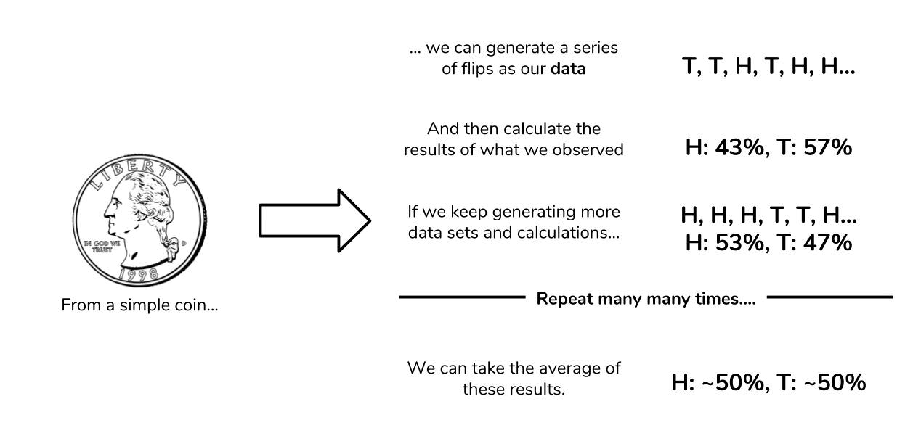

# Dunder Methods

### What Are Dunder Methods?
-  special methods are a set of predefined methods you can use to enrich your classes. 

- These “dunders” or “special methods” in Python are also sometimes called “magic methods.”

```
class NoLenSupport:
    pass

>>> obj = NoLenSupport()
>>> len(obj)
TypeError: "object of type 'NoLenSupport' has no len()"
```

- To fix this, you can add a `__len__` dunder method to your class:

```
class LenSupport:
    def __len__(self):
        return 42

>>> obj = LenSupport()
>>> len(obj)
42
```

## Object Initialization: `__init__`

- Right upon starting my class I already need a special method. To construct account objects from the Account class I need a constructor which in Python is the `__init__` dunder:

example:
```
class Account:
    """A simple account class"""

    def __init__(self, owner, amount=0):
        """
        This is the constructor that lets us create
        objects from this class
        """
        self.owner = owner
        self.amount = amount
        self._transactions = []
```

## Object Representation: `__str__`, `__repr__`

1- `__repr__`: The “official” string representation of an object. This is how you would make an object of the class. The goal of `__repr__`is to be unambiguous.

2- `__str__`: The “informal” or nicely printable string representation of an object. This is for the enduser.

# Statistics - Probability

### What is probability?

- At the most basic level, probability seeks to answer the question, “What is the chance of an event happening?

###  From statistics to probability

- Our data will be generated by flipping a coin 10 times and counting how many times we get heads. Our data point will be the number of heads we observe. We may not get the “ideal” 5 heads, but we won’t worry too much since one trial is only one data point. If we perform many, many trials, we expect the average number of heads over all of our trials to approach the 50%. The code below simulates 10, 100, 1000, and 1000000 trials, and then calculates the average proportion of heads observed. Our process is summarized in the image below as well.



example of flipping coin:

```
import random
def coin_trial():
heads = 0
for i in range(100):
    if random.random() <= 0.5:
        heads +=1
    return heads
def simulate(n):
    trials = []
    for i in range(n):
        trials.append(coin_trial())
    return(sum(trials)/n)
simulate(10)
>>> 5.4
simulate(100)
>>> 4.83
simulate(1000)
>>> 5.055
simulate(1000000)
>>> 4.999781
```

