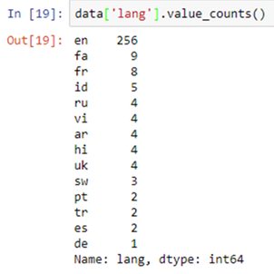

# pandas

- pandas is like Excel in Python: it uses tables (namely DataFrame) and operates transformations on the data. But it can do a lot more.


- importing pandas:

`import pandas as pd`

## Object creation

EXAMPLE:
- Creating a Series by passing a list of values

```
s = pd.Series([1, 3, 5, np.nan, 6, 8])

s
Out[4]: 
0    1.0
1    3.0
2    5.0
3    NaN
4    6.0
5    8.0
dtype: float64
```

## Viewing data

1.  Head and tail

To view a small sample of a Series or DataFrame object, use the head() and tail() methods. The default number of elements to display is five, but you may pass a custom number.

EXAMPLE:
```
long_series = pd.Series(np.random.randn(1000))

long_series.head()
Out[5]: 
0   -1.157892
1   -1.344312
2    0.844885
3    1.075770
4   -0.109050
dtype: float64

long_series.tail(3)
Out[6]: 
997   -0.289388
998   -1.020544
999    0.589993
dtype: float64
```

2. DataFrame.to_numpy()

-  gives a NumPy representation of the underlying data. 

- NumPy arrays have one dtype for the entire array, while pandas DataFrames have one dtype per column. 

EXAMPLE:

- If the data frame had only one data type
```
df.to_numpy()
Out[17]: 
array([[ 0.4691, -0.2829, -1.5091, -1.1356],
       [ 1.2121, -0.1732,  0.1192, -1.0442],
       [-0.8618, -2.1046, -0.4949,  1.0718],
       [ 0.7216, -0.7068, -1.0396,  0.2719],
       [-0.425 ,  0.567 ,  0.2762, -1.0874],
       [-0.6737,  0.1136, -1.4784,  0.525 ]])
```

- if the data frame had multible data types

```
df2.to_numpy()
Out[18]: 
array([[1.0, Timestamp('2013-01-02 00:00:00'), 1.0, 3, 'test', 'foo'],
       [1.0, Timestamp('2013-01-02 00:00:00'), 1.0, 3, 'train', 'foo'],
       [1.0, Timestamp('2013-01-02 00:00:00'), 1.0, 3, 'test', 'foo'],
       [1.0, Timestamp('2013-01-02 00:00:00'), 1.0, 3, 'train', 'foo']],
      dtype=object)
```

3. describe()

- shows a quick statistic summary of your data

```
df.describe()
Out[19]: 
              A         B         C         D
count  6.000000  6.000000  6.000000  6.000000
mean   0.073711 -0.431125 -0.687758 -0.233103
std    0.843157  0.922818  0.779887  0.973118
min   -0.861849 -2.104569 -1.509059 -1.135632
25%   -0.611510 -0.600794 -1.368714 -1.076610
50%    0.022070 -0.228039 -0.767252 -0.386188
75%    0.658444  0.041933 -0.034326  0.461706
max    1.212112  0.567020  0.276232  1.071804
```

## The basic functions of pandas

1. Logical operations

2. Basic plotting

3. Counting occurrences


4. Operations on full rows, columns, or all data

- `data['column_1'].map(len)` The .map() operation applies a function to each element of a column.


