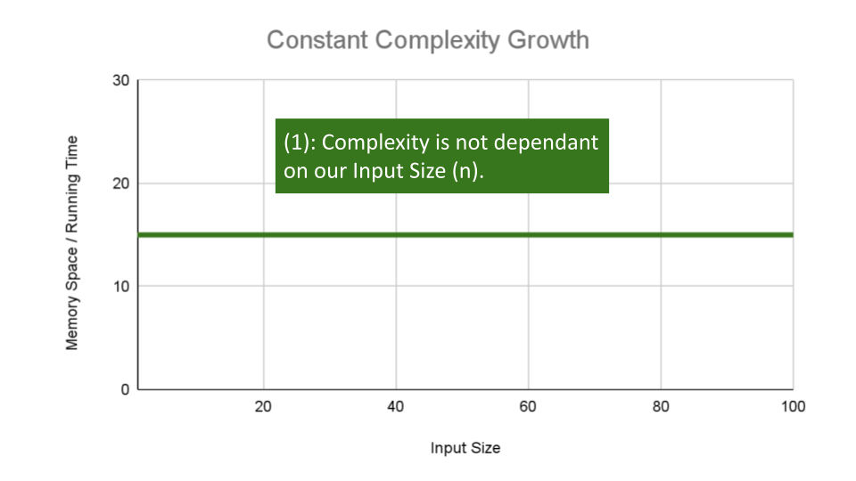
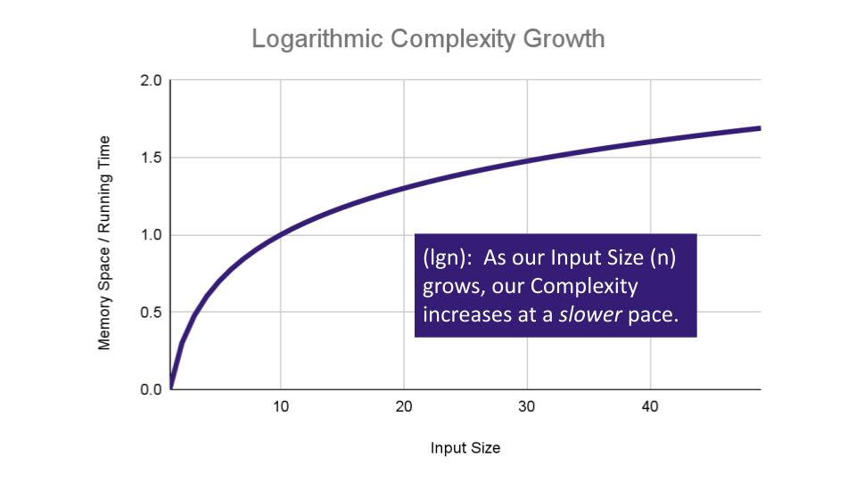
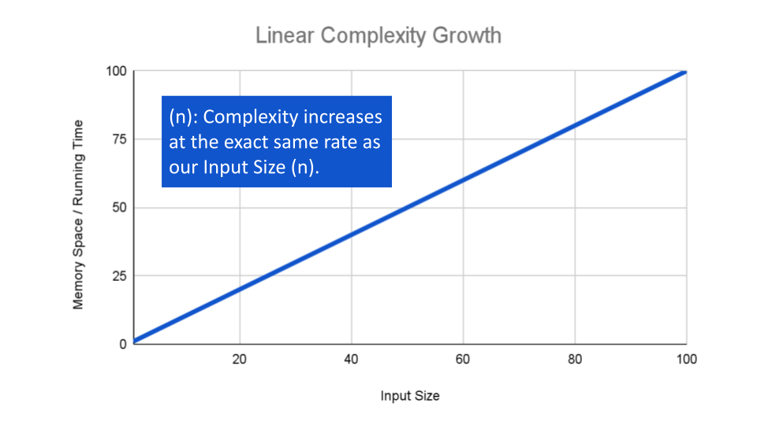

## Big O: Analysis of Algorithm Efficiency:


### what is Big o :
the big o describes the efficiency of a function depending on tow factors :

1. Running Time : The amount of time a function needs to complete.

2. Memory Space : The amount of memory resources a function uses to store data and instructions.

we should consider 4 Key Areas for analysis big O to a function :

### Input Size:


the running time for a function depends on the input 
the input can be a single value or multiple values like (arrays)

To evaluate a function for Time and Space complexity, we need a way to measure each of these factors.


### Units of Measurement

### Orders of Growth:


## some complexity types :

1. Constant Complexity
*Constant Complexity means that no matter what inputs are thrown at our algorithm, it always uses the same amount of time or space.*



example :
```
ALGORITHM Sum(number a, number b)

   number val <-- a + b
   return val
```

2. Logarithmic Complexity:



example :
```
AlGORITHM Search(SortedArray[0...n - 1], int SearchValue)

    number mid <-- n/2

    firstHalf <-- SortedArray[0...mid]
    secondHalf <-- SortedArray[mid...n]
    current <-- SortedArray[mid]

    if current > SearchValue
          return Search(firstHalf, SearchValue)
    if current < SearchValue
          return Search(secondHalf, SearchValue)

    return current
```

3. linear Complexity:



# Linked Lists

## What is a Linked List:
"*A data structure that contains nodes that links/points to the next node in the list.*"

## Linked Lists types:

- Singly:
*Singly refers to the number of references the node has.*


- Doubly:*Doubly refers to there being two (double) references within the node.* 

### nodes

*Nodes are the individual items links that live in a linked list. Each node contains the data for each link.*


- we cant use (for) loops in linked Lists because we depend on the "Next" value to guide us to the next refrence

example : 
*"Let’s put a use case on our traversal. We want to check whether or not our LinkedList Includes a specific value.

The pseudo-code for an Includes is as so:"*
```
ALGORITHM Includes (value)
// INPUT <-- integer value
// OUTPUT <-- boolean

  Current <-- Head

  WHILE Current is not NULL
    IF Current.Value is equal to value
      return TRUE

    Current <-- Current.Next

  return FALSE
```

1. first we assign the current value to the list "Head" which is the first node, to make sure we start from the first element

2. create a while loop it will loop as long the value is not null 

3. check if the value is in the list 

## adding a node :

we can add a node using add(method)

exmple:
pseducode for adding a node 

```
ALGORITHM Add(newValue)
// INPUT <-- Value to add
// OUTPUT <-- No output

  newNode <-- NEW Node
  newNode.Value <-- newValue
  newNode.Next <-- Head
  Head <-- newNode
```


