# Introduction to SQL

## sql (Structured Query Language):

its a language designed to  manipulate and transform data from a relational database

## Relational databases:

*relational database represents a collection of related (two-dimensional) tables.*

### SQL COMMANDS :

- To retrieve data from a SQL database, we need to write "SELECT"

`SELECT column, another_column, …`

`FROM mytable;`

- To get a specific rows in the table we can use "WHERE" 

`SELECT column, another_column, …`

`FROM mytable`

`WHERE condition`

    `AND/OR another_condition
    AND/OR …;`
    
    
 -  to discard rows that have a duplicate column value "DISTINCT"
    
    `SELECT DISTINCT column, another_column, …`
  
`FROM mytable`

`WHERE condition(s);`

- Using the "JOIN" clause in a query, we can combine row data across two separate tables using this unique key.
 The first of the joins that we will introduce is the "INNER JOIN".
 
 `SELECT column, another_table_column, …`
 
`FROM mytable`

`INNER JOIN another_table
`
    `ON mytable.id = another_table.id`
    
`WHERE condition(s)`

`ORDER BY column, … ASC/DESC`

`LIMIT num_limit OFFSET num_offset;`

### sql table :

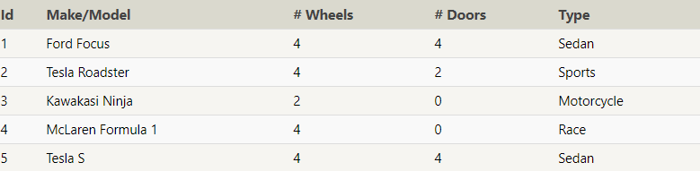

_____________________________________________________________________________

## completed tasks:
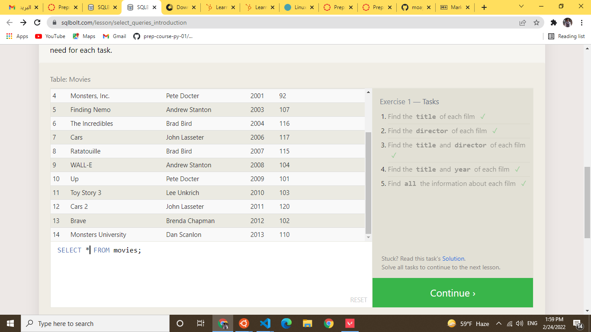

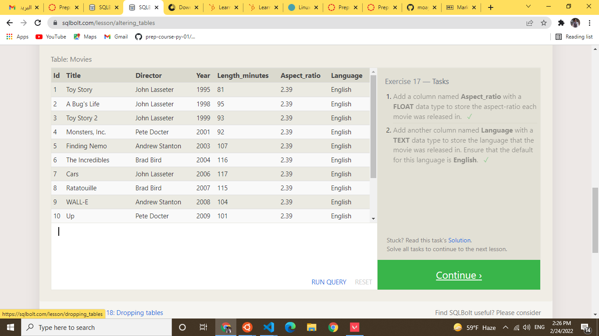
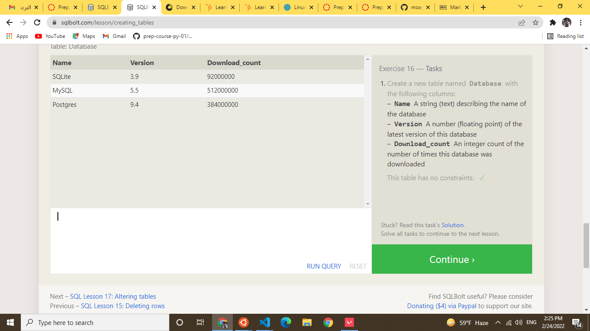
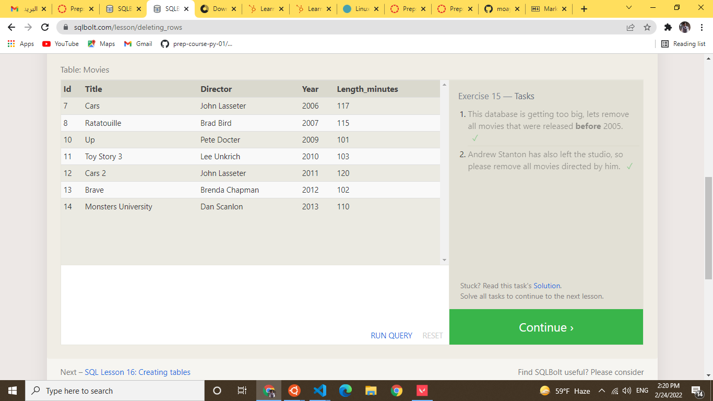
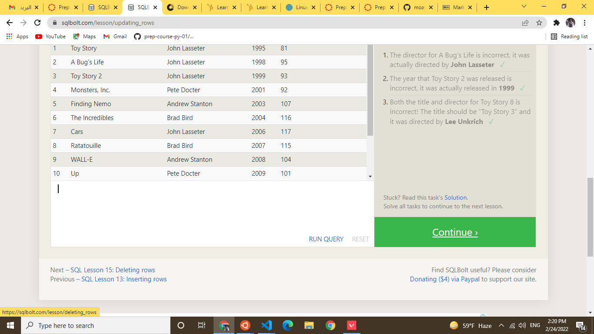
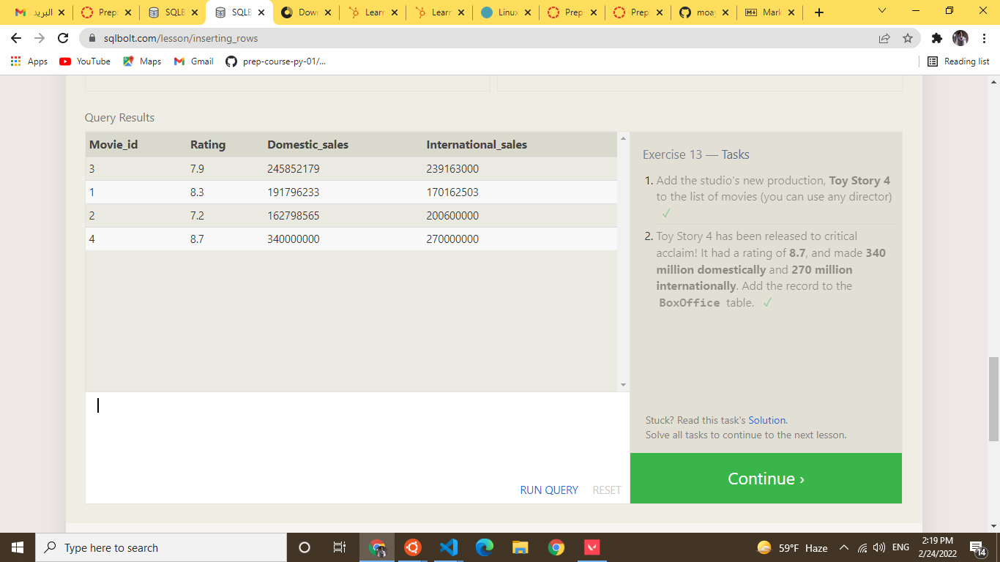
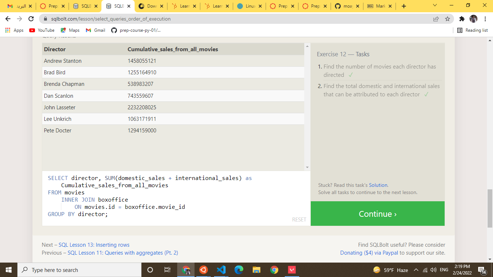
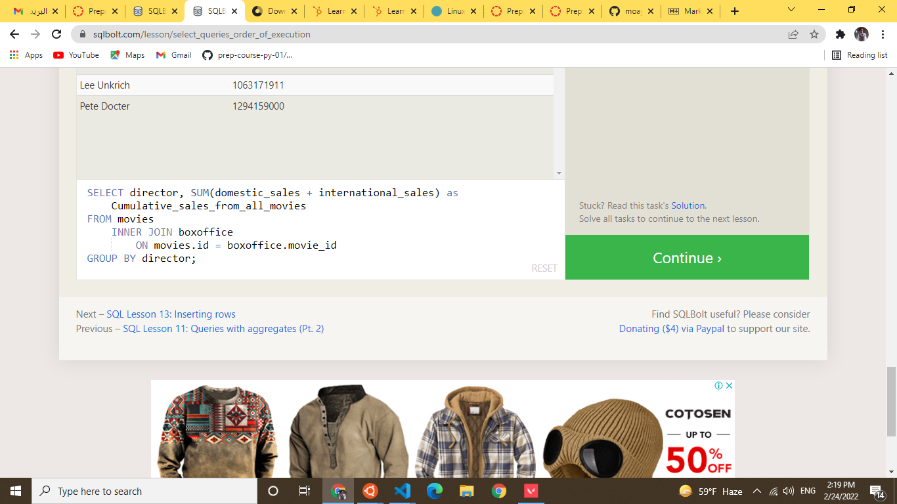

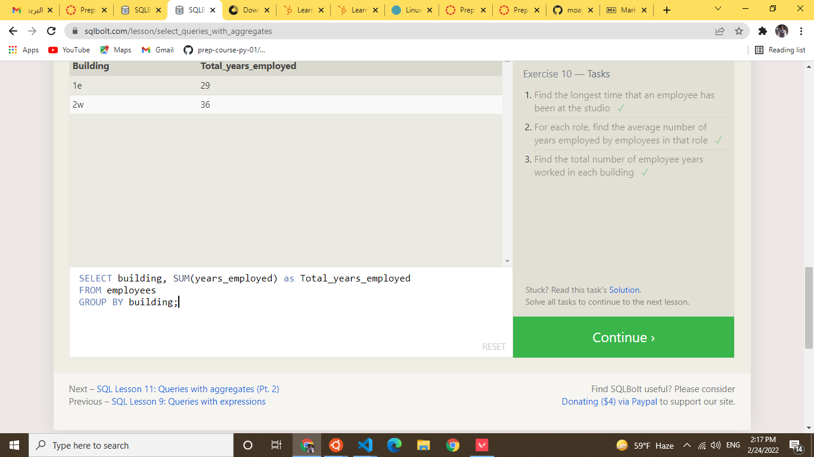
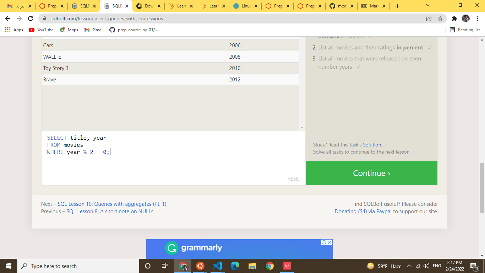

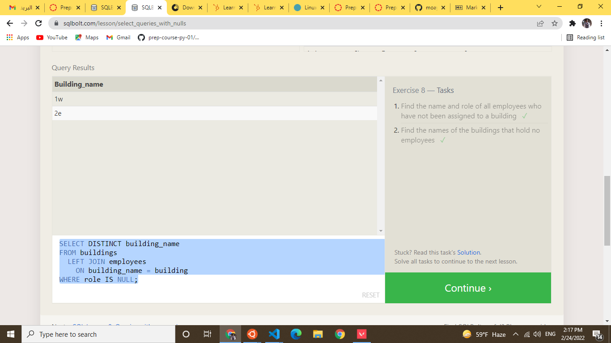
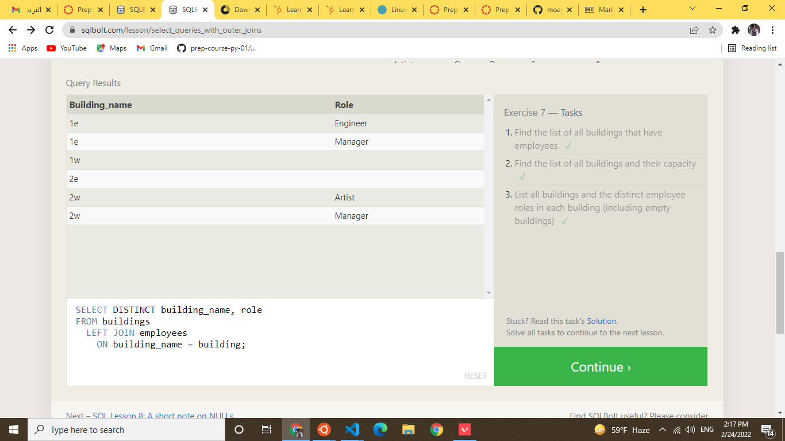
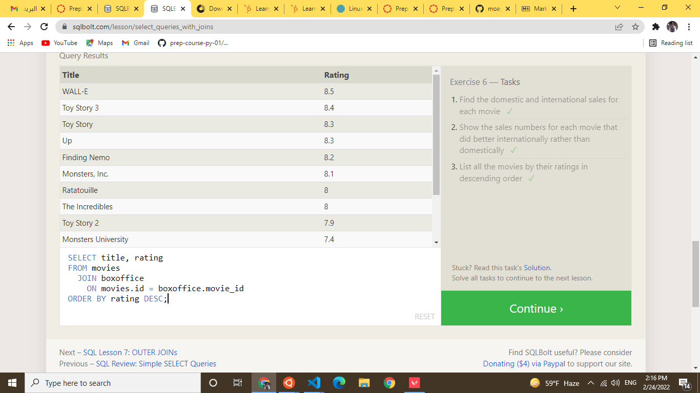
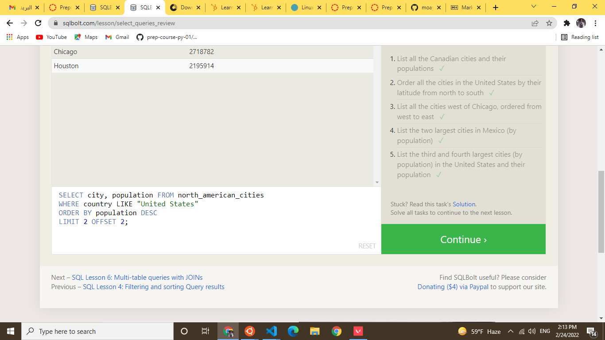
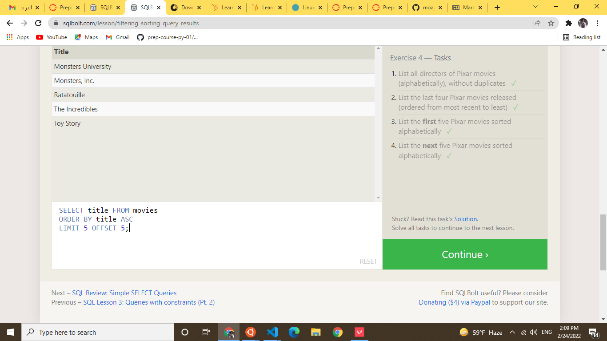
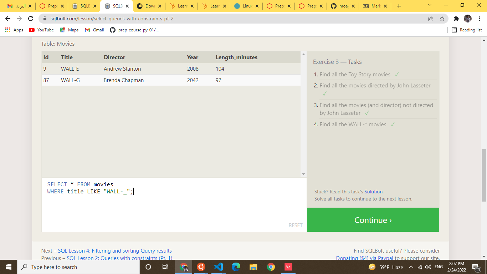
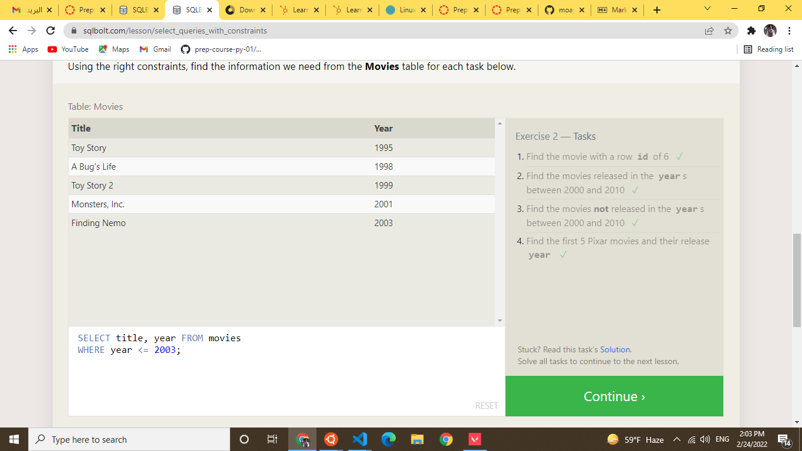
