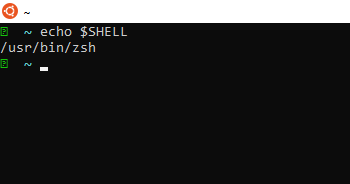
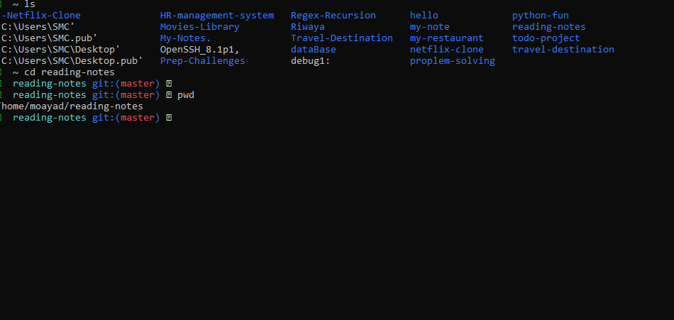

# The command line 

the command lind (terminal):

*text based interface to the system. were you are able to enter commands and feedback will be given to you.*

## The shell:
 *its the part that defines how the terminal will behave and looks after running commands for you.*

### if you would like to know which shell you are using:

use this commane : echo $shell

## Basic Navigation:
 here is some of the commands for moving around in the system:

 1. "pwd" (Print Working Directory)
 *to make sure you are in the right location use this command*

 2. "ls"

 3. "cd" (change directory.):
 *to move around in the system use this command*

 

### Relative path:
A file or directory location relative to where we currently are in the file system.
### Absolute path:
A file or directory location in relation to the root of the file system.

## More About Files:

### Linux is an Extensionless System:

*the type of the file can be detarmined from the extension which is the characters after a full stop at the end of a file*
 
 #### example:
 "file.(exe)"
 "file.(txt)"

 ### the space in the command line is how we seperate items:
 *in order to move to file with tow words "moayad abukhadra" you can use the  'Quotes' or the backslash(\) between the two words*

 ## Hidden Files and Directories:

 *in order to make a hidden file or directory creat it with it name begins with (.)*

 ## Manual Pages:

 *The manual pages are a set of pages that explain every command available on your system and what they do*

 ### commands :
 - man <"command">
Look up the manual page for a particular command.

- man -k <"search term">
Do a keyword search for all manual pages containing the given search term.

- /<"term"">
Within a manual page, perform a search for 'term'

- n

After performing a search within a manual page, select the next found item.

## File Manipulation:

- Making a Directory:

 mkdir (name of directory)

 - Removing a Directory:
 rmdir (name of directory)

 you can find a list of the commands [here](https://ryanstutorials.net/linuxtutorial/cheatsheet.php)

